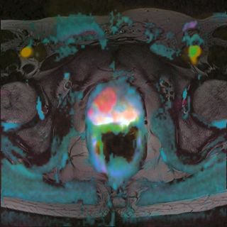

# Color-based visualization of multiparametric MRI data

##Summary
This code repository can be used to create color-coded visualizations from multiparametric magnetic resonance imaging data. It belongs to the following paper:

Jakob Nikolas Kather, Anja Weidner, Ulrike Attenberger, Yannick Bukschat, Cleo-Aron Weis, Meike Weis, Lothar R. Schad, Frank Gerrit Zöllner: "Color-coded visualization of magnetic resonance imaging multiparametric maps", Scientific Reports, 2016

Please refer to this paper for an in-depth description of the method. For more information, contact JN Kather: ORCID http://orcid.org/0000-0002-3730-5348

##How to use

1. Specify  constants in ./subroutine/getConstantsMRI.m
2. Open main_createDatasetFiles.m and ensure that input DICOM data files are located in the folder specified here
3. Run main_createDatasetFiles.m to create a short meta-file for each data set
4. Open main_reColorMRI.m and specify which data set should be processed
5. Run main_reColorMRI.m
6. View resulting images as PNG or DICOM (using OsiriX Dicom Viewer)

##Requirements

The code requires Matlab (we recommend R2016a) and runs on Windows and OS X.

##Sample image

